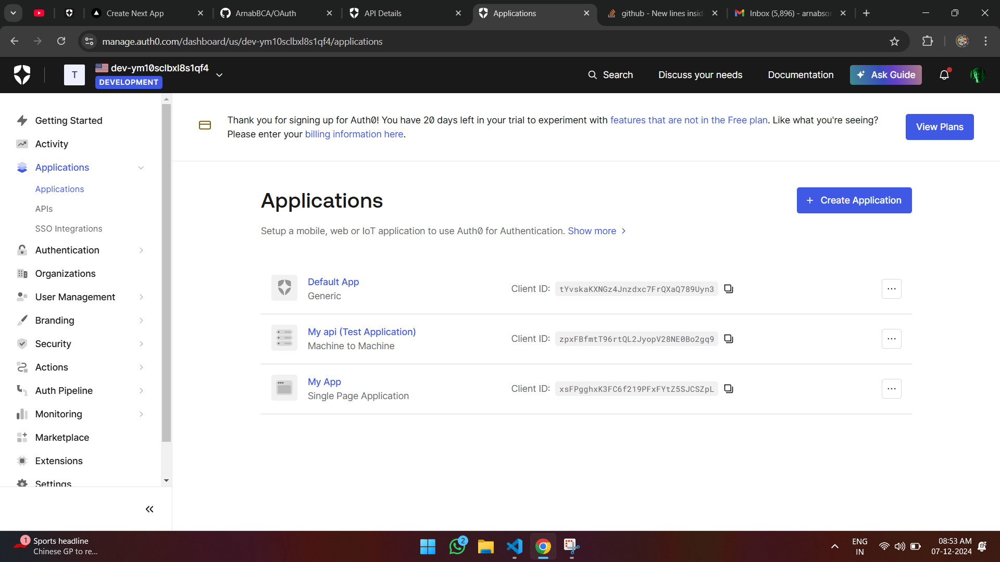
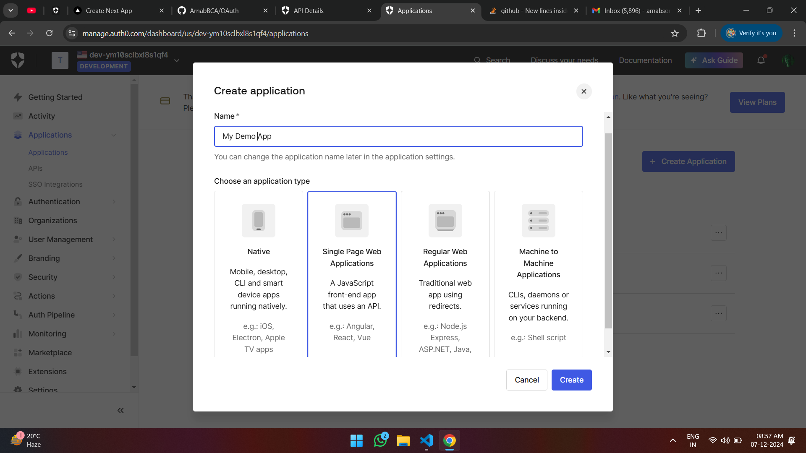
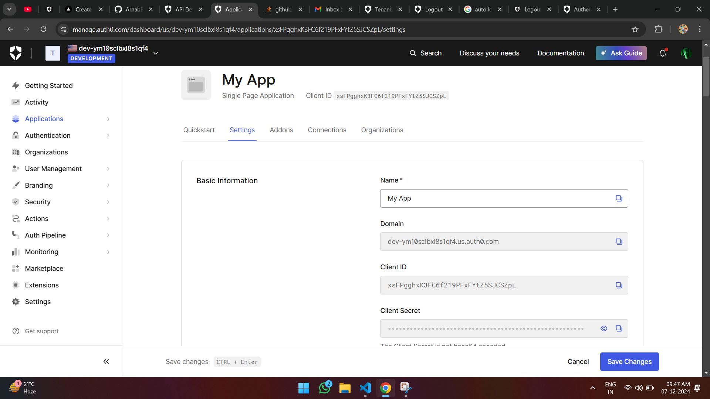
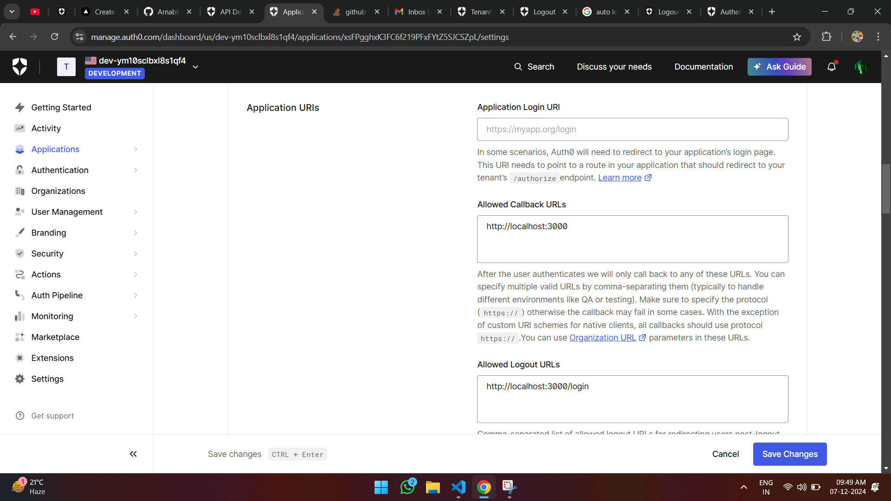
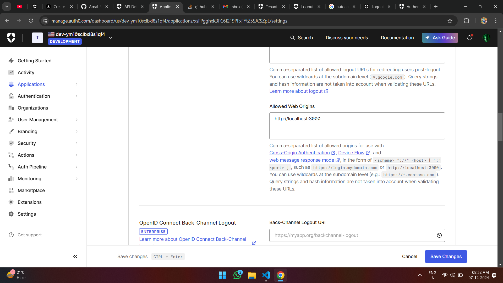
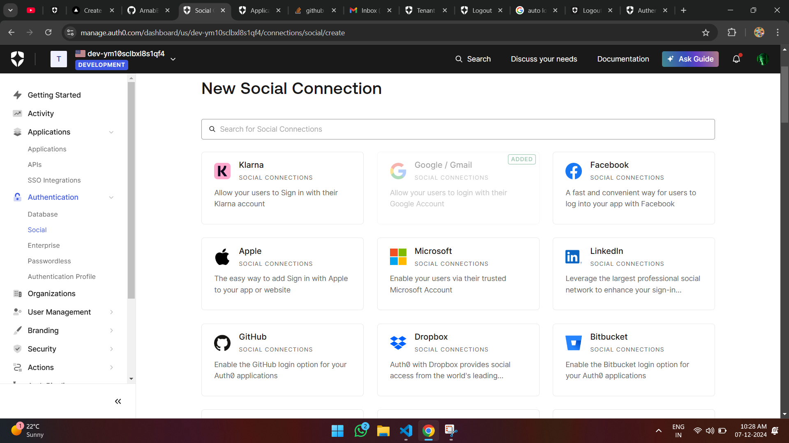
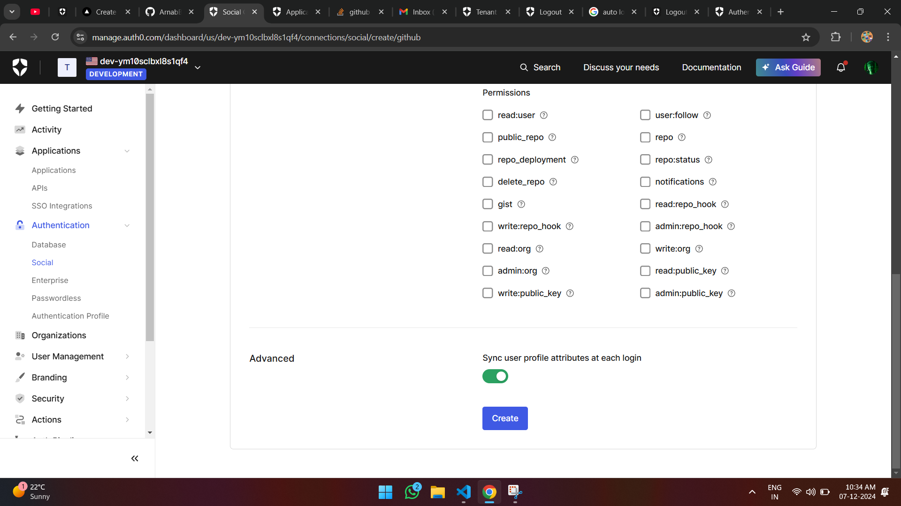
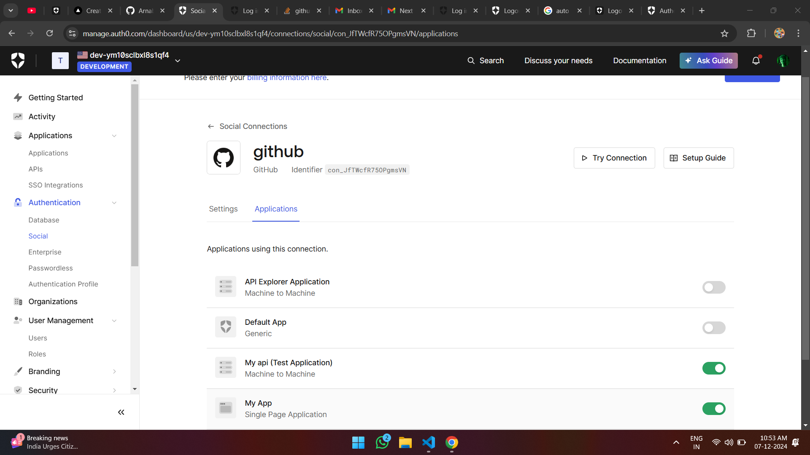

This is a [Next.js](https://nextjs.org) project bootstrapped with [`create-next-app`](https://nextjs.org/docs/app/api-reference/cli/create-next-app).

## [Documentation](./USE_LIBRARY.md) on how to use the library.

## To Setup the demo Project

### Step 1: First, clone the repo

```bash
git clone https://github.com/ArnabBCA/OAuth.git
```

### Step 2: Install Dependencies

```bash
npm install
```

### Step 4 : Visit AuthO by Okta and create a account

```bash
https://auth0.com/
```

### Step 5: Follow the steps below to get your .env.local variables.

### Step 6 : On the left handside on the dashboard page click Application then APIs then click `CREATE API`


### Step 7 : One the `Name` field give any name of your choice. <br/> On the `Identifier` type the following `https://demo.com/api` you can adjust the nameing if you want but it should start with `https://` <br/> Keep all the other fields to default values.


### Step 8 :Then Open the API you just created And `COPY` the `Identifier` which you created earlier and put inside the `.local.env` as given below below

```bash
NEXT_PUBLIC_AUDIENCE_TARGET_API=(yourkey)
```


### Step 9 :Scroll below and toggle the `Allow Offline Access` and then CLick `Save`


### Step 10 : Move to Applications then click the button `Create Application`



### Step 11 : In the Dialog select `Single Page Applications` then click the `Create` button.



### Step 12 : Open the Created Application and copy the `Domain`, `Client ID`, ans paste in the `.env.local`

```bash
NEXT_PUBLIC_DOMAIN=(yourkey)
NEXT_PUBLIC_CLIENT_ID=(yourkey)
```



### Step 13 : Then as shown in the pictures given below scroll and input the following in their respective fields `Allowed Callback URLs`, `Allowed Logout URLs`, `Allowed Web Origins` <br/> Keep rest of the field to default values




<br />

### Step 14 : Your final `.env.local` should look like this paste this file in the root project folder.

```bash
NEXT_PUBLIC_DOMAIN=(yourkey)
NEXT_PUBLIC_CLIENT_ID=(yourkey)
NEXT_PUBLIC_AUDIENCE_TARGET_API=(yourkey)

NEXT_PUBLIC_CALLBACK_URL=http://localhost:3000
NEXT_PUBLIC_LOGOUT_URL=http://localhost:3000/login
```

### Step 4: Start the development server

```bash
npm run dev
```

### Open [http://localhost:3000](http://localhost:3000) with your browser to see the result.

# Adding more social providers (Optional)

### Step 1: Go to the `Authentication` tab then to `Social` then click `Create Connection`



### Step 2: Choose a Social Connection for example `GitHub` then open it then click `Continue. On the dialog box click `Create` leave every thing to default values




### Step-3: Toggle the Applications ( `API` and `Single Page Application`) we created Earlier.<Br> Below is a Eample: The the names of the applications will be different in your case


