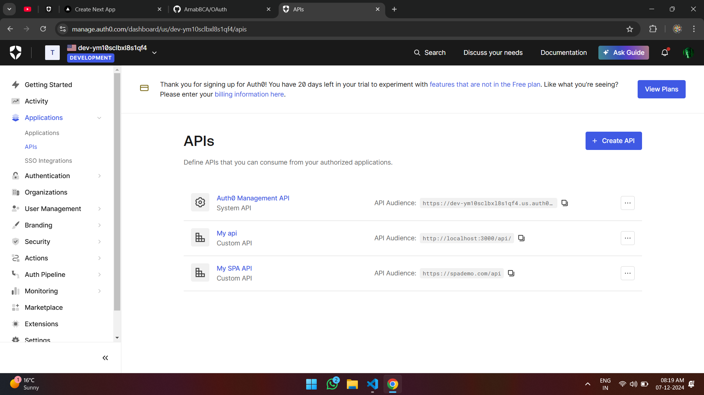
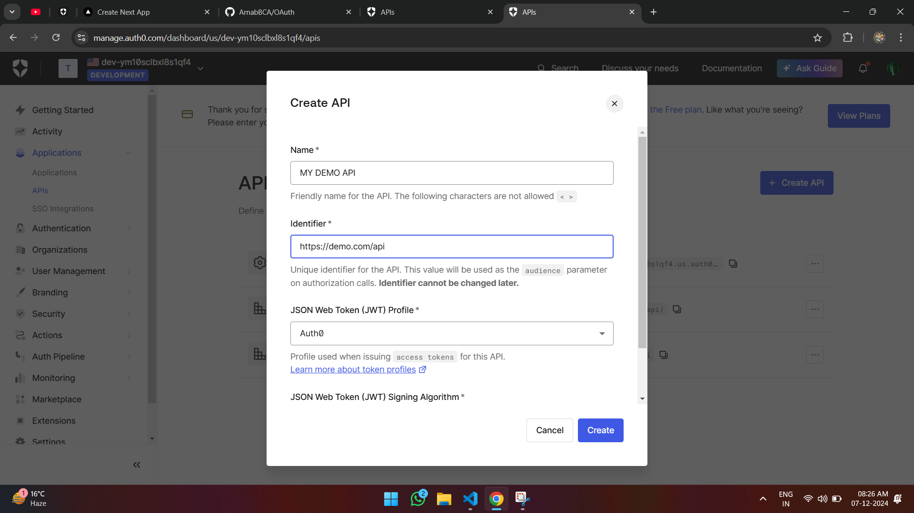
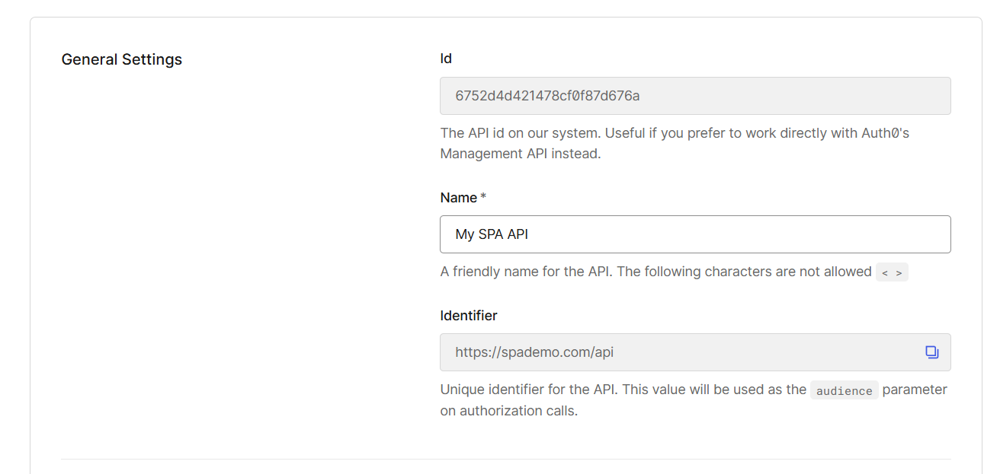
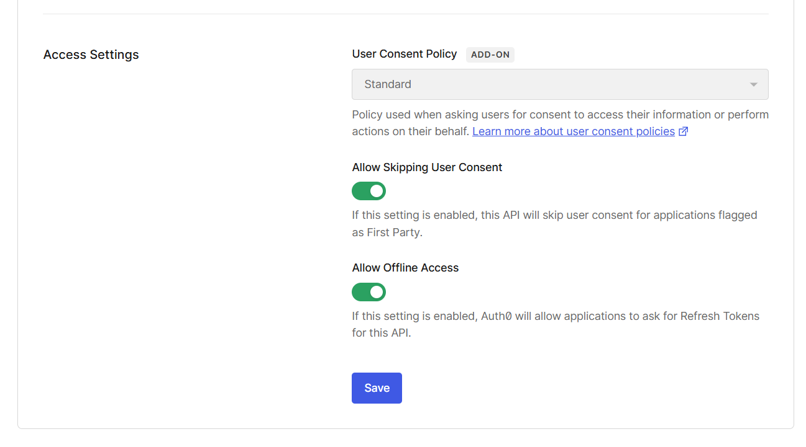

This is a [Next.js](https://nextjs.org) project bootstrapped with [`create-next-app`](https://nextjs.org/docs/app/api-reference/cli/create-next-app).

## To test the library

Step 1: First, clone the repo

```bash
git clone https://github.com/ArnabBCA/OAuth.git
```

Step 2: Install Dependencies

```bash
npm install
```

Step 3: Follow the steps below to get your .env.local variables.

Step 4 : Visit AuthO by Okta and create a account

```bash
https://auth0.com/
```

Step 5 : On the left handside on the dashboard page click Application then APIs then click `CREATE API`



Step 6 :
### One the `Name` field give any name of your choice 

### On the `Identifier` type the following `https://demo.com/api` you can adjust the nameing if you want but it should start with `https://`
### Keep all the other fields to default values

### Then Open the API you just created And `COPY` the `Identifier` which you created earlier and put inside the `.local.env` as given below below
```bash
NEXT_PUBLIC_AUDIENCE_TARGET_API=(yourkey)
```


### Scroll below and toggle the `Allow Offline Access` and then CLick `Save`



<br />

```bash
NEXT_PUBLIC_DOMAIN=(yourkey)
NEXT_PUBLIC_CLIENT_ID=(yourkey)
NEXT_PUBLIC_AUDIENCE_TARGET_API=(yourkey)

NEXT_PUBLIC_CALLBACK_URL=h(yourkey)
NEXT_PUBLIC_LOGOUT_URL=(yourkey)
```

Step 4: Start the development server
```bash
npm run dev
```

Open [http://localhost:3000](http://localhost:3000) with your browser to see the result.